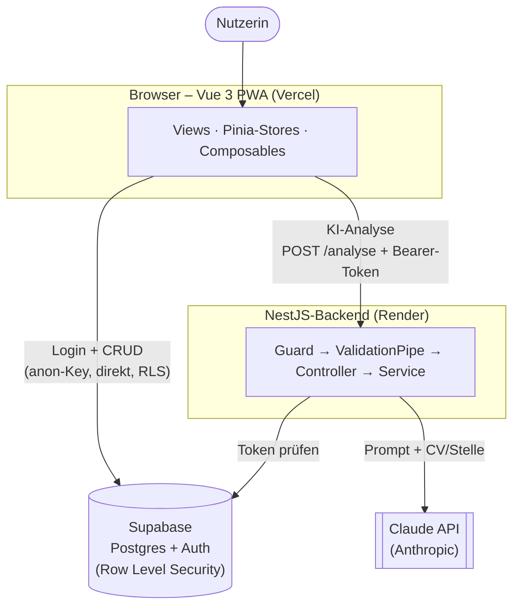
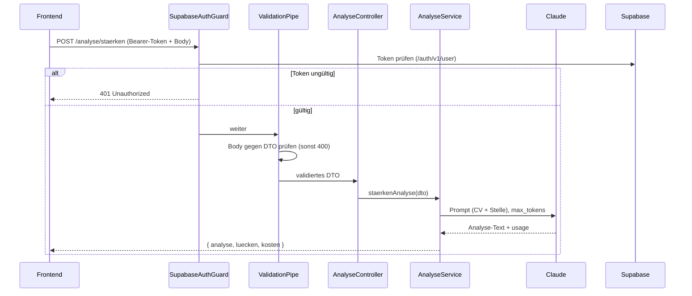
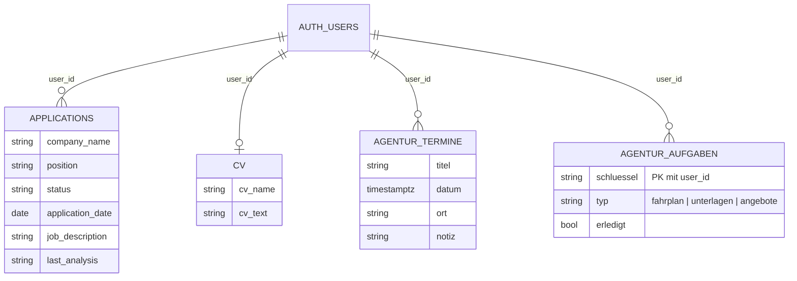
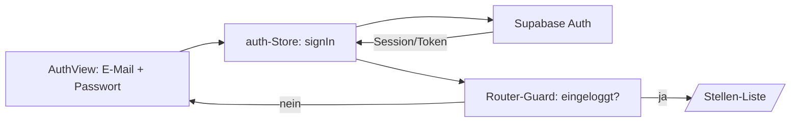

# Aspira – technische Dokumentation

Begleiter für Bewerbung & Karriere: Stellen/Bewerbungen verwalten, den eigenen Lebenslauf per KI gegen eine
konkrete Stelle abgleichen und den Übergang in die Arbeitslosigkeit organisieren.

Diese Doku erklärt **Architektur, Aufbau, Datenmodell, Abläufe, Sicherheit, Tests/CI und Deployment** – als
Nachschlagewerk und zum Einarbeiten.

---

## 1. Überblick

Aspira besteht aus zwei Teilen in einem Monorepo:

- **Frontend** (`aspira/frontend`) – eine Vue-3-PWA (Vercel).
- **Backend** (`aspira/backend`) – eine NestJS-API (Render), die **nur** die KI-Analyse bereitstellt.

Daten und Login laufen über **Supabase** (Postgres + Auth). Die KI-Funktion nutzt **Claude** (Anthropic).

---

## 2. Architektur



**Kernidee:** Das Frontend spricht für **Login und alle CRUD-Aktionen direkt mit Supabase** – abgesichert
durch Row Level Security (RLS). **Nur** die KI-Analyse geht über das eigene NestJS-Backend, weil dort der
**geheime Claude-Key** liegt und Eingaben/Kosten kontrolliert werden. Die Begründung dieser Aufteilung steht
in [Abschnitt 11](#11-architektur-entscheidungen--trade-offs).

---

## 3. Tech-Stack

| Schicht | Technologien |
|---|---|
| Frontend | Vue 3 + TypeScript, Vuetify 4, Pinia, Vue Router, Vite, vite-plugin-pwa |
| Backend | NestJS (TypeScript), `@anthropic-ai/sdk`, class-validator / class-transformer |
| Daten & Auth | Supabase (Postgres, Auth, Row Level Security) |
| KI | Claude (`claude-sonnet-4-6`) |
| Tests | Vitest (Frontend), Jest (Backend) |
| CI/CD | GitHub Actions; Vercel (FE) + Render (BE), Auto-Deploy bei Push auf `main` |

---

## 4. Projektstruktur

```
aspira/
├── frontend/
│   └── src/
│       ├── views/         # Seiten (ApplicationList, ApplicationDetail, ApplicationForm,
│       │                  #         CvView, AgenturView, UeberAspiraView, AuthView)
│       ├── components/     # auth/ · applications/ · agentur/
│       ├── stores/         # Pinia: auth, applications, agentur
│       ├── composables/    # useCv, useOnline
│       ├── lib/            # supabase, authErrors, applicationsCache, fehler, datum, pdfText
│       ├── types/          # application, agentur
│       ├── router/         # Routen + Login-Guard
│       ├── App.vue         # App-Bar + Layout
│       └── main.ts         # Einstieg: Pinia, Vuetify(Theme), Router
└── backend/
    └── src/
        ├── analyse/        # analyse.module/controller/service + dto/
        ├── auth/           # supabase-auth.guard
        ├── app.module/controller/service (+ /health)
        └── main.ts         # Bootstrap: CORS, ValidationPipe, BodyParser
```

---

## 5. Frontend im Detail

- **`main.ts`** – richtet Pinia, Vuetify (mit Marken-Orange `#F39200` als `primary`) und den Router ein und
  lädt **vor** dem ersten Routen-Guard die Session (`useAuthStore().init()`).
- **`App.vue`** – durchgehende App-Bar: links Bereichswechsel `Stellen | Agentur`, mittig „Aspira", rechts
  Utilities (Theme, CV, Über, Logout; auf dem Handy im ⋮-Menü). Plus Offline-Banner.
- **Views**
  - `ApplicationList` – Stellen-Liste mit Status-Filter.
  - `ApplicationForm` – Anlegen/Bearbeiten einer Stelle.
  - `ApplicationDetail` – Detail inkl. KI-Stärken-Analyse-Dialog.
  - `CvView` – Lebenslauf (PDF → Text, in Supabase gespeichert).
  - `AgenturView` – Termine + 3 Checklisten (Angebote, ALG-Fahrplan, Unterlagen).
  - `UeberAspiraView` – „Über Aspira".
  - `AuthView` – Login/Registrierung.
- **Stores (Pinia, Setup-Stil)**
  - `auth` – Session, `signIn/signUp/signOut`, lauscht auf Auth-Änderungen.
  - `applications` – CRUD der Stellen + Offline-Cache (`applicationsCache`).
  - `agentur` – Termine-CRUD + Checklisten-Zustand (`setErledigt`).
- **Composables** – `useCv` (CV laden/speichern/löschen, Supabase + Offline-Kopie), `useOnline`
  (Online-Status).
- **lib** – `supabase` (Client), `authErrors` (DE-Fehlertexte), `applicationsCache` (localStorage),
  `fehler` (`freundlicherFehler`), `datum` (`datumZeit`), `pdfText` (PDF→Text im Browser).
- **Wiederverwendbare Komponente** – `agentur/ChecklisteSection.vue` rendert alle drei Checklisten
  datengetrieben (Props: Titel, Icon, Punkte, `typ`, Fortschritt).

---

## 6. Backend im Detail

Eine **request pipeline** pro KI-Aufruf:



- **`analyse.module.ts`** – bündelt Controller, Service, Guard.
- **`analyse.controller.ts`** – `POST /analyse/staerken`, `POST /analyse/verfeinern`; `@UseGuards`.
- **`analyse.service.ts`** – baut den Prompt, ruft Claude (`claude-sonnet-4-6`, `max_tokens` 1500), trennt
  Analyse/Lücken am Marker `===LÜCKEN===`, berechnet die USD-Kosten aus `usage`; Fehler → sauberer **502**.
- **`auth/supabase-auth.guard.ts`** – liest `Authorization: Bearer <token>` und verifiziert ihn bei Supabase;
  ohne/ungültig → **401**.
- **`analyse/dto/*.dto.ts`** – `StaerkenDto` / `VerfeinernDto` mit `class-validator` (`@IsString`,
  `@IsNotEmpty`, `@MaxLength` …). `@MaxLength` begrenzt zugleich die an Claude geschickte Textmenge.
- **`main.ts`** – `enableCors` (nur erlaubte Frontend-Adressen), globale `ValidationPipe`
  (`whitelist`+`transform`), größeres JSON-Limit für CV-Text.
- **`app.controller.ts`** – `GET /health` für Monitoring.

---

## 7. Datenmodell (Supabase)



- Jede Tabelle hat eine `user_id`-Spalte (Verweis auf `auth.users`).
- **Row Level Security** auf allen Tabellen: Policy `auth.uid() = user_id` → jede:r sieht/ändert nur die
  eigenen Zeilen. Rechte (`select/insert/update/delete`) sind an die Rolle `authenticated` vergeben.
- `agentur_aufgaben` speichert nur **den Zustand** der fest im Frontend definierten Checklisten-Punkte
  (Primärschlüssel `user_id + schluessel`, Upsert).

---

## 8. Wichtige Abläufe

**Login / Session**



**KI-Stärken-Analyse:** siehe Sequenzdiagramm in [Abschnitt 6](#6-backend-im-detail). Der CV-Text wird
**im Browser** aus der PDF gelesen (`pdfText`), in Supabase gespeichert und bei der Analyse als Text ans
Backend geschickt – die PDF selbst verlässt den Browser nie.

---

## 9. Sicherheit

- **Daten-Isolation:** Row Level Security (s. o.) – nicht clientseitig, sondern in der DB erzwungen.
- **anon-Key vs. Geheimnis:** Im Browser liegt nur der **öffentliche** Supabase-anon-Key (so vorgesehen). Der
  **Claude-Key** liegt ausschließlich serverseitig (Render-Env).
- **Auth-Guard:** Die `/analyse`-Endpunkte verlangen einen gültigen Supabase-Login-Token (serverseitig
  geprüft) → kein anonymer (kostenpflichtiger) Zugriff.
- **CORS:** Backend akzeptiert nur die konfigurierten Frontend-Adressen.
- **Eingabevalidierung:** DTOs + `ValidationPipe` (`whitelist` entfernt Unbekanntes); `@MaxLength` begrenzt
  Textmengen.
- **Secrets:** `.env`-Dateien sind gitignored; keine Schlüssel im Code.

---

## 10. Tests & CI

- **Backend (Jest):** `AnalyseService` (Anthropic-SDK gemockt – Antwort-Zerlegung, Kosten, Prompt),
  `SupabaseAuthGuard` (alle 401-Fälle + Durchlass), DTO-Validierung, `/health`.
- **Frontend (Vitest):** `authErrors` (DE-Übersetzungen), `applicationsCache` (localStorage).
- Ausführen: `npm test` jeweils in `frontend` / `backend`.
- **CI** (`.github/workflows/ci.yml`): baut, lintet und testet beide Teile bei jedem Push/PR auf `main`.

---

## 11. Architektur-Entscheidungen & Trade-offs

**Warum direkt-zu-Supabase + nur ein dünnes Backend für die KI?**

- Bei einem **Backend-as-a-Service** (Supabase) ist der direkte Zugriff das **vorgesehene** Muster: Auth und
  CRUD sind eingebaut, RLS sichert die Daten – das spart sehr viel Boilerplate (keine CRUD-Endpunkte/DTOs für
  jedes Entity).
- Server-seitig muss **nur** sein, was ein Geheimnis braucht: der **Claude-Key**. Deshalb gibt es das
  NestJS-Backend gezielt für die KI.
- **Nebeneffekt (Vorteil):** Da CRUD direkt läuft, bleibt die App schnell, auch wenn das Render-Free-Tier-
  Backend gerade „schläft" (Kaltstart ~50 s beträfe sonst jede Aktion).

**Alternative – ein einziges Backend für alles** (Browser → NestJS → DB) wäre ebenfalls legitim (klassische
Schichtenarchitektur, DB gar nicht exponiert), bedeutet aber **deutlich mehr Code** (Controller/Service/DTO je
Entity, eigene Besitzprüfung statt RLS) und würde den Kaltstart auf **jede** Aktion ausweiten. Für Aspiras
Umfang überwiegt der schlanke BaaS-Ansatz.

---

## 12. Lokale Entwicklung & Deployment

Siehe [`frontend/README.md`](frontend/README.md) und [`backend/README.md`](backend/README.md) für Setup,
Umgebungsvariablen und Befehle. Deployment: Frontend → Vercel (Root `aspira/frontend`), Backend → Render
(Root `aspira/backend`); beide deployen automatisch bei Push auf `main`.
