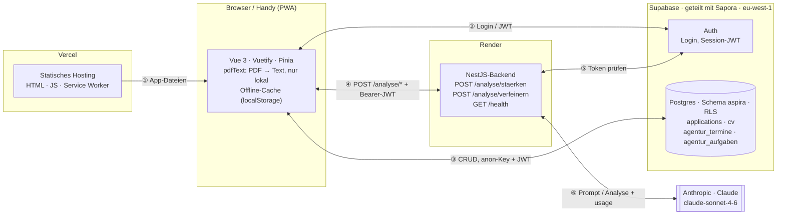

# Aspira


**Aspira** (von lat. _aspirare_ – „anstreben, aufstreben") ist ein Begleiter für Bewerbung und
Karriere: Stellen und Bewerbungen verwalten, den eigenen Lebenslauf per KI gegen eine konkrete Stelle
abgleichen und den Übergang in die Arbeitslosigkeit (Agentur-Termine, ALG-Fahrplan, Unterlagen)
organisieren.

## Funktionen

- **Stellen-Pipeline** – Stellen/Bewerbungen mit Status (von „interessant" über „beworben" bis
  „zusage/absage"), Prioritäten und Wunschfirmen; Filter und Statusübersicht.
- **KI-Stärken-Analyse** – gleicht den hinterlegten CV gegen die Stellenbeschreibung ab (passende
  Stärken, Lücken, Rückfragen) und zeigt die Claude-Kosten je Aufruf an.
- **CV-Verwaltung** – CV-Text wird im Konto gespeichert und ist auf allen Geräten verfügbar.
- **Arbeitsagentur & Übergang** – Termine, Angebote der Agentur, ALG-Fahrplan und Unterlagen-Checkliste.
- **PWA** – installierbar, Offline-Lesezugriff, Hell-/Dunkel-Modus.

## Tech-Stack

- **Frontend:** Vue 3 + TypeScript, Vuetify 4, Pinia, Vue Router, Vite, vite-plugin-pwa
- **Backend:** NestJS (TypeScript), `@anthropic-ai/sdk` (Claude), class-validator
- **Daten & Auth:** Supabase (Postgres + Auth, Row Level Security)
- **Tests:** Vitest (Frontend), Jest (Backend)
- **Hosting:** Vercel (Frontend), Render (Backend)

## Architektur



Das Frontend redet für CRUD/Login **direkt** mit Supabase (durch Row Level Security abgesichert). Nur
die KI-Analyse läuft über das NestJS-Backend – es verbirgt den Claude-Key, prüft per Auth-Guard den
Supabase-Login-Token und schränkt CORS auf die echte Frontend-Adresse ein. Vercel liefert nur die
gebaute App aus, ohne eigene Logik.

| # | Von ↔ Nach | Was fließt | Wie |
|---|---|---|---|
| ① | Vercel → Browser | Die gebaute App (HTML, JS, CSS, Service Worker) | HTTPS beim Öffnen und bei Updates, danach aus dem PWA-Cache |
| ② | Browser ↔ Supabase Auth | → E-Mail + Passwort · ← Session mit JWT | supabase-js mit dem öffentlichen anon-Key |
| ③ | Browser ↔ Postgres | ↔ Stellen, CV-Text, Termine, Checklisten · → Analyse-Ergebnis zurück in `applications` (`last_analysis`, `gaps`, `analyzed_at`) | PostgREST mit anon-Key + JWT; RLS filtert auf die eigene `user_id` |
| ④ | Browser ↔ Render | → `POST /analyse/staerken` bzw. `/verfeinern` mit CV-Text und Stellentext · ← `{ analyse, luecken, kosten }` | HTTPS/JSON, `Authorization: Bearer <JWT>`; CORS nur für die Vercel-Adresse; Kaltstart im Free Tier ~50 s |
| ⑤ | Render ↔ Supabase Auth | → mitgeschicktes JWT · ← gültig oder nicht (sonst 401) | `SupabaseAuthGuard` ruft `/auth/v1/user` |
| ⑥ | Render ↔ Claude | → Prompt mit CV und Stelle · ← Analyse-Text + Token-Verbrauch (daraus die USD-Kosten) | Anthropic-SDK, Key nur in der Render-Umgebung; bei Fehler antwortet Render mit 502 |

**Gemeinsames Supabase-Projekt:** Aspira teilt sich das Supabase-Projekt mit der App Sapora. Die
Tabellen sind durch Schemas getrennt (`aspira` bzw. `public`), **Auth ist aber gemeinsam**: dieselbe
Nutzerliste, dieselben Auth-Einstellungen (Site-URL, Redirects, Registrierung), dieselben
Free-Tier-Grenzen. Eine Änderung an Auth wirkt auf beide Apps.

### Server-Logik (keine Edge Functions)

Aspira nutzt keine Supabase Edge Functions. Ihre Rolle – Code mit geheimem Schlüssel auf einem Server –
übernimmt das NestJS-Backend auf Render. Es schreibt nichts in die Datenbank; das Ergebnis speichert
das Frontend (③).

- **`POST /analyse/staerken`** – gleicht den Lebenslauf mit einer Stellenbeschreibung ab.
  1. Guard prüft das JWT bei Supabase (⑤), sonst 401.
  2. `ValidationPipe` prüft den Body gegen `StaerkenDto`; `@MaxLength` deckelt die Textmenge, unbekannte
     Felder werden entfernt.
  3. Service baut den Prompt und ruft Claude Sonnet 4.6 (⑥, max. 1500 Output-Tokens).
  4. Die Antwort wird am Marker `===LÜCKEN===` in Analyse und Lücken geteilt, die Kosten werden aus
     `usage` berechnet.
- **`POST /analyse/verfeinern`** – überarbeitet eine vorhandene Analyse; gleicher Ablauf mit `VerfeinernDto`.
- **`GET /health`** – Lebenszeichen fürs Monitoring, ohne Login und ohne Claude-Aufruf.

Nebeneffekt der Aufteilung: Schläft das Render-Backend, bleibt der Rest der App trotzdem schnell, weil
CRUD nie über Render läuft. Details: [`DOKUMENTATION.md`](DOKUMENTATION.md).

## Projektstruktur

```
aspira/
├── frontend/   # Vue-App (Stellen, CV, Agentur-Bereich, PWA)
└── backend/    # NestJS-API (KI-Stärken-Analyse)
```

## Lokale Entwicklung

Voraussetzungen: Node 24+, ein Supabase-Projekt, ein Anthropic-API-Schlüssel (nur fürs Backend).

### Frontend

```bash
cd frontend
cp .env.local.example .env.local   # Werte eintragen
npm install
npm run dev                        # http://localhost:5173
```

### Backend

```bash
cd backend
cp .env.example .env               # Werte eintragen
npm install
npm run start:dev                  # http://localhost:3000
```

Die benötigten Umgebungsvariablen stehen in `frontend/.env.local.example` bzw. `backend/.env.example`.

## Tests

```bash
cd frontend && npm test    # Vitest
cd backend  && npm test    # Jest
```

## Deployment

- **Frontend → Vercel:** Root Directory `aspira/frontend`, Env-Variablen `VITE_SUPABASE_URL`,
  `VITE_SUPABASE_ANON_KEY`, `VITE_API_URL`.
- **Backend → Render:** Root Directory `aspira/backend`, Build `npm install && npm run build`, Start
  `npm run start:prod`, Env-Variablen `ANTHROPIC_API_KEY`, `SUPABASE_URL`, `SUPABASE_ANON_KEY`,
  `FRONTEND_URL`.

Beide deployen automatisch bei einem Push auf `main`.

---

Aspira ist Teil des Monorepos [`claude-lab`](../README.md).
